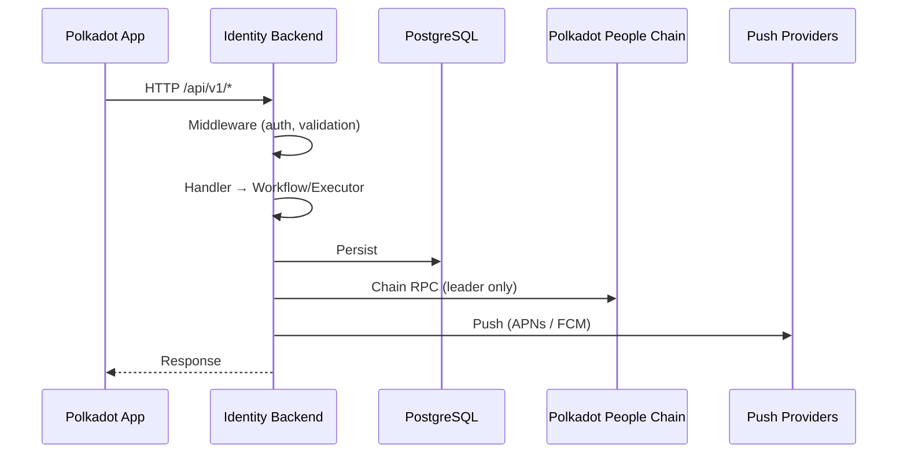

# apps/identity-backend — Architecture

> Progressive disclosure for agents. Start with `AGENTS.md` for the rulebook; come here for diagrams, data, and glossary when the rulebook points you to it.

## Single-leader concurrency

Exactly one process runs `daemon-leader` at any instant. All others serve HTTP only and submit zero chain transactions. The lock is a PostgreSQL session-scoped advisory lock, key `identity-backend:daemon-leader`, `mode: 'required'`.

```mermaid
flowchart TB
    subgraph Deployment["N running processes"]
        direction TB
        Leader["Leader (1)"]
        Followers["Followers (N-1)"]
    end

    subgraph LeaderWork["Leader holds advisory lock"]
        direction TB
        DL[daemon-leader]
        DL --> ChainMetrics
        DL --> DimTicket
        DL --> IndividualityIndexer
        DL --> InvitationTicket
        DL --> NotificationsProcessor
        DL --> LiteUsernameReg
        DL --> RegistrationQueue
    end

    subgraph FollowerWork["Followers: lock busy"]
        direction TB
        API[/api/v1/*]
        WH[/webhooks]
        AD[/admin]
        HC[/healthcheck]
    end

    Leader --> LeaderWork
    Followers --> FollowerWork
    DB[(PostgreSQL)] -->|pg_try_advisory_lock| Leader
```

Lock service, pool, and reaper all live in `src/leader-election/`. Composition root is `src/runtime.ts` — `layerDaemonLeaderSupervisor` is the only entry point.

Child supervisors (all `lock: { mode: 'none' }`):

```bash
grep -rn "extends Effect.Service<.*Supervisor>\|extends Context.Tag<.*Supervisor>" apps/identity-backend/src/supervision/ | grep -v DaemonLeader
```

See `src/leader-election/AGENTS.md` for the lock key, reaper query, and `pg_locks` negative-`hashtext` trap.

## Domain model

Every feature follows read (impure) → decode to branded domain types → decide in a pure `*.workflow` returning `Either<Decision, Error>` → shape outputs → write (impure).

- Decisions stay pure. I/O stays a thin shell. Dependencies point inward.
- Decode foreign shapes at the boundary; never cast.
- Target suffixes: `*.schema`, `*.workflow`, `*.acl`, `*.store`, `*.executor`, `*.policy`.

**Edge:** Hono + single global `app.onError` + `ProblemDetail`. A route decodes the request, calls a workflow/executor, and returns. The decision lives in a pure `*.workflow.ts`.

## Request flow



**Background path (leader only):** `daemon-leader` acquires the advisory lock → forks child supervisors → workers poll/stream conditions, process batches, persist results.

## Project structure

```
apps/identity-backend/
├── src/
│   ├── app.ts                    # Hono application factory
│   ├── main.ts                   # Entry point (BunRuntime)
│   ├── runtime.ts                # Effect layer composition root
│   ├── config.ts                 # Environment configuration
│   ├── runtime/                  # Logger, Rx, OTEL dispatch
│   ├── data/                     # Cross-cutting errors
│   ├── db/                       # DB connection and schema
│   ├── features/                 # Domain features (DMMF target)
│   ├── infrastructure/           # Blockchain RPC, Sentry, telemetry
│   ├── jwt/                      # Token issuance and rotation
│   ├── leader-election/          # Advisory lock
│   ├── lib/                      # Problem details, SS58, probes
│   ├── metrics/                  # Metrics definitions
│   ├── middleware/               # HTTP middleware
│   ├── routes/                   # HTTP route handlers
│   ├── schema/                   # Shared Zod schemas
│   ├── supervision/              # Background daemon supervisors
│   ├── types/                    # Shared TypeScript types
│   └── webrtc/                   # TURN credential issuance
├── tests/                        # Integration and E2E tests
├── drizzle/                      # Database migrations
└── otel.ts                       # Test OTEL setup
```

## Core components

**Stack:** Bun · Hono + `@hono/zod-openapi` · Effect-TS · Vitest + `@effect/vitest` · OpenTelemetry OTLP + Sentry

routes[5]{prefix,purpose}:
/api/v1/*,public api
/webhooks,external webhooks
/admin,admin operations
/healthcheck /livez /readyz,health probes
/api/swagger/json,openapi 3.1 spec

authentication[2]{layer,owner}:
platform attestation,authPlugin middleware
sr25519 client proof,route handler

## Data stores

tables[14]{name,purpose}:
individuality_usernames,username registrations and status
challenges,single-use attestation challenges
apple_attestations,ios attestation records
dim_tickets,dim ticket lifecycle
invitation_tickets,pre-generated invitation keypairs
push_subscription,device push tokens
subscription_rule,matching rules for push notifications
push_record,delivery records
failed_push_record,failed delivery records
rate_limit,per-sender rate limiting
android_device_identifiers,android device ids
refresh_tokens,jwt refresh tokens
registration_queue_entries,username registration queue (table retained; queue router intentionally unmounted — see `src/routes/AGENTS.md`)
leader_election,advisory lock observability

PostgreSQL is the only state shared between processes.

## External integrations

integrations[5]{name,purpose,technology}:
polkadot people chain,on-chain username registration and dim tickets,websocket rpc via substrate-client
asset hub,secondary chain interactions,websocket rpc
apple app attest / devicecheck / apns,ios attestation and push,apple sdks
google play integrity / fcm,android attestation and push,google sdks
web push protocol,browser push notifications,vapid keypair

## Deployment

Multi-instance, shared-nothing. Multiple processes serve HTTP. A single `daemon-leader` holds the advisory lock for background work. In-memory state is process-local and ephemeral.

## Security

- Platform attestation + SR25519 client proof + JWT with refresh rotation
- Route-level JWT verification, device-specific token binding
- `Redacted<string>` for secrets, TLS for external communication

## Glossary

terms[13]{term,definition}:
username,personhood proof formatted as {base}.{digits}
attestation,cryptographic proof submitted to chain
registration state,RESERVED → ASSIGNED | FAILED
invitation ticket,dim ticket granting the right to register
indexer,daemon syncing on-chain state to local db
bff,backend-for-frontend
dim,dual identity mechanism (game or proofofink)
dmmf,domain modelling made functional
people chain,polkadot parachain for identity
asset hub,polkadot parachain for assets
sr25519,schnorr signature scheme
apns,apple push notification service
fcm,firebase cloud messaging

## Progressive-disclosure pointers

| If you are editing...        | Read this file's...                         | Read also...                                                     |
| ---------------------------- | ------------------------------------------- | ---------------------------------------------------------------- |
| Route handlers               | § Core components (routes/auth)             | `src/routes/AGENTS.md`                                           |
| Middleware (auth, JWT, etc.) | § Core components (routes/auth)             | `src/middleware/AGENTS.md`                                       |
| Leader-election code         | § Single-leader concurrency                 | `src/leader-election/AGENTS.md`                                  |
| Daemons / supervisors        | § Single-leader concurrency, § Request flow | `src/supervision/AGENTS.md`                                      |
| DIM / invitation tickets     | § Domain model, § Data stores               | `src/features/dim/AGENTS.md`, `src/features/dim/ARCHITECTURE.md` |
| OTel / Sentry                | § Core components                           | `src/runtime/otel/AGENTS.md`                                     |
